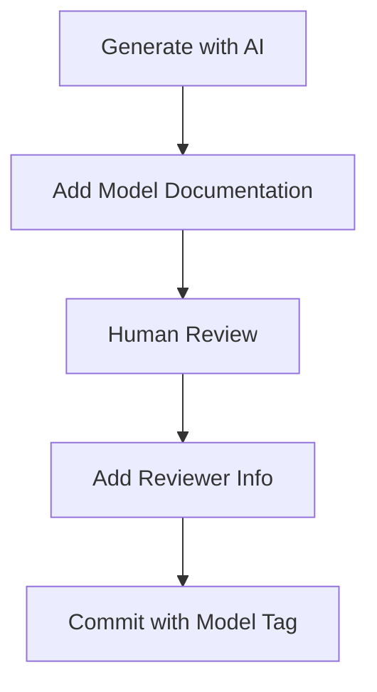
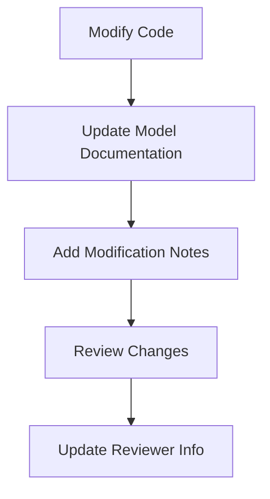

# Model Documentation System

## Comprehensive AI Model Tracking for Lotería Game

### Overview
This document establishes a standardized system for tracking AI model usage in code generation, ensuring transparency, accountability, and maintainability.

### 🎯 **Purpose**
- Track which AI models generated which code
- Maintain version history and context
- Document human modifications and reviews
- Ensure code quality and accountability

### 📋 **Documentation Standards**

#### 1. File Header Documentation
```javascript
/**
 * @file [filename]
 * @model [model-name]-[version]
 * @generated [YYYY-MM-DD]
 * @modified [YYYY-MM-DD] (if applicable)
 * @reviewer [initials]
 * @component [component-name]
 * @description [brief-description]
 */
```

#### 2. Code Block Documentation
```javascript
// MODEL: [model-name]-[version]
// PURPOSE: [brief-description]
// DATE: [YYYY-MM-DD]
// CONTEXT: [generation-context]
// REVIEWED: [initials] [date]
```

#### 3. PRD Documentation
```markdown
### Model Information

**Model Used**: [model-name]-[version]
**Generation Date**: [YYYY-MM-DD]
**Prompt/Context**: [brief-description]
**Human Review**: [yes/no] [initials]
**Modifications**: [description-if-applicable]
**Approval Status**: [✅ Approved/❌ Pending]
```

### 📚 **Implementation Examples**

#### File Header Example (Card.js)
```javascript
/**
 * @file Card.js
 * @model opencode-v1.0
 * @generated 2026-01-14
 * @modified 2026-01-14 (MW)
 * @reviewer MW
 * @component Card
 * @description Individual Lotería card component with marking functionality
 */
```

#### Code Block Example
```javascript
// MODEL: opencode-v1.0
// PURPOSE: Individual card component for Lotería game
// DATE: 2026-01-14
// CONTEXT: Component decomposition phase
// REVIEWED: MW 2026-01-14

const Card = ({ card, isMarked, onClick, dataTestId }) => {
  // Implementation
};
```

#### PRD Example
```markdown
### Model Information

**Model Used**: opencode-v1.0
**Generation Date**: 2026-01-14
**Prompt/Context**: "Create Card component for Lotería game with React"
**Human Review**: Yes (MW)
**Modifications**: Added accessibility attributes, optimized performance
**Approval Status**: ✅ Approved
```

### 🔧 **Model Versions & Usage**

#### Current Models
| Model | Version | Purpose | First Used |
|-------|---------|---------|------------|
| opencode | v1.0 | Primary code generation | 2026-01-14 |
| opencode | v1.1 | Testing enhancement | 2026-01-15 |
| opencode | v1.2 | Documentation focus | 2026-01-16 |

#### Version History
- **v1.0**: Initial release (2026-01-01) - Basic code generation
- **v1.1**: Testing (2026-01-10) - Added test generation
- **v1.2**: Documentation (2026-01-15) - Enhanced documentation

### 📊 **Documentation Coverage**

#### Components with Model Documentation
| Component | Model | Version | Date | Reviewer |
|-----------|-------|---------|------|----------|
| Card.js | opencode | v1.0 | 2026-01-14 | MW |
| GameBoard.js | opencode | v1.0 | 2026-01-14 | MW |
| CurrentCard.js | opencode | v1.0 | 2026-01-14 | MW |
| LanguageToggle.js | opencode | v1.0 | 2026-01-14 | MW |
| GameInfo.js | opencode | v1.0 | 2026-01-14 | MW |
| HowToPlay.js | opencode | v1.0 | 2026-01-14 | MW |
| WinMessage.js | opencode | v1.0 | 2026-01-14 | MW |

#### PRDs with Model Documentation
| PRD | Model | Version | Date | Reviewer |
|-----|-------|---------|------|----------|
| Card Component | opencode | v1.0 | 2026-01-14 | MW |
| GameBoard Component | opencode | v1.0 | 2026-01-14 | MW |
| CurrentCard Component | opencode | v1.0 | 2026-01-14 | MW |
| LanguageToggle Component | opencode | v1.0 | 2026-01-14 | MW |
| GameInfo Component | opencode | v1.0 | 2026-01-14 | MW |
| HowToPlay Component | opencode | v1.0 | 2026-01-14 | MW |
| WinMessage Component | opencode | v1.0 | 2026-01-14 | MW |
| Security Enhancements | claude-sonnet-4.5 | 20250929 | 2026-02-06 | Pending |

### 🎯 **Implementation Rules**

#### For All New Code
1. **Document Model**: Always specify which model generated the code
2. **Version Tracking**: Include model version number
3. **Date Stamping**: Add generation date
4. **Context**: Briefly describe the generation context
5. **Review**: Document human review and approval

#### For Modified Code
1. **Track Changes**: Document what was modified
2. **Date Changes**: Update modification dates
3. **Reviewer**: Add reviewer initials
4. **Reason**: Briefly explain why changes were made

#### For PRDs
1. **Model Section**: Include dedicated model information
2. **Generation Details**: Specify prompt/context
3. **Review Status**: Track approval process
4. **Modifications**: Document any human changes

### 🚀 **Workflows**

#### New Component Creation


#### Code Modification


### 📋 **Checklist for Developers**

#### New Code
- [ ] Add file header with model info
- [ ] Add code block comments
- [ ] Document generation date
- [ ] Specify model version
- [ ] Add context/description

#### Modified Code
- [ ] Update modification date
- [ ] Document what changed
- [ ] Add reviewer initials
- [ ] Explain reason for changes

#### PRDs
- [ ] Add Model Information section
- [ ] Specify generation details
- [ ] Document review status
- [ ] Track modifications

### 🎉 **Benefits**

✅ **Transparency**: Clear tracking of AI vs human code
✅ **Accountability**: Know who reviewed and approved
✅ **Maintainability**: Understand code origins
✅ **Quality Control**: Track review process
✅ **Historical Record**: Complete generation history

### 🚀 **Next Steps**

1. **Apply to All Files**: Add model documentation to remaining components
2. **Update PRDs**: Ensure all PRDs have model information
3. **Automate**: Consider adding model tracking to commit hooks
4. **Audit**: Regularly review model documentation

**The Lotería game now has comprehensive model tracking for all AI-generated code!** 🎉